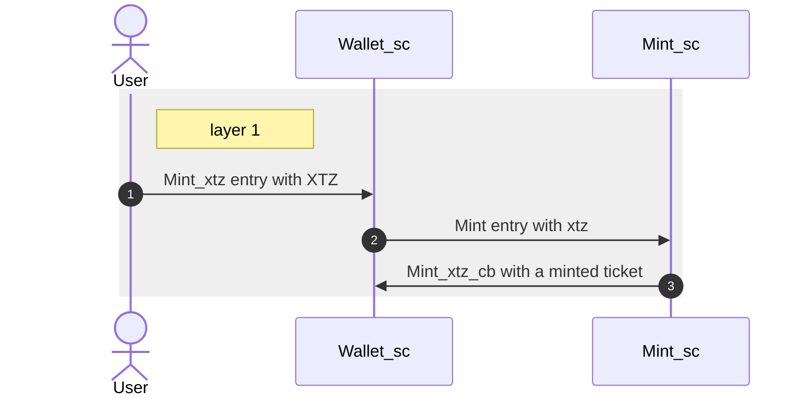
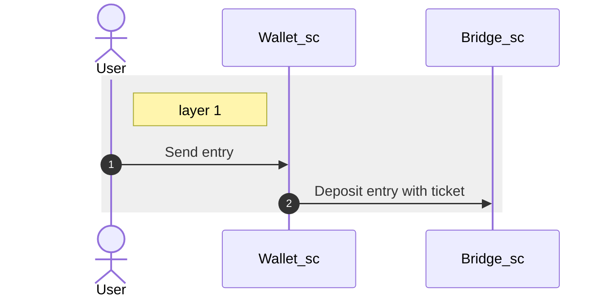
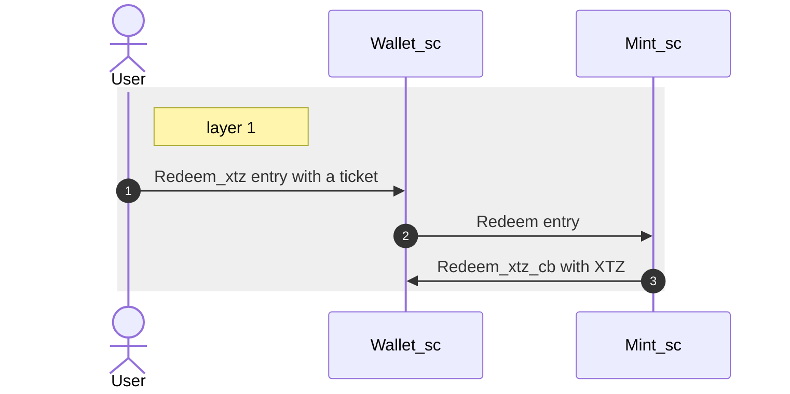

# Documentation
## Layer1
### Wallet Smart Contract

Wallet smart contract, implemented in `wallet_sc`, provides a way for participants to interact with rollup. Its functions includes minting a ticket via mint smart contract, implemented in `mint_sc`, sending a ticket to bridge and redeem xtz from `mint_sc`.

#### Minting a ticket
In Tezos, only tickets with the same *kind* can be joined(`join_ticket`) together. The *kind* consists of payload and ticketer. Therefore, we rely on `mint_sc` to create tickets with the same kind. `wallet_sc` allows participants to easily mint without worried details. When participants transfer xtz and call the entry of `wallet_sc` to mint a ticket, `wallet_sc` acts as a proxy to transfer xtz and call `mint_sc` to create a ticket. `mint_sc` will send a ticket back to `wallet_sc` and `wallet_sc` will store in its storage. There are two entrypoints related mint in `wallet_sc`:

- `Mint_xtz`: For participants to initiate minting a ticket.
- `Mint_xtz_cb`: The callback function for `mint_sc` to store a ticket in the storage of `wallet_sc`.

#### Sending a ticket
When participants perform a function of sending a ticket. The ticket in storage of `wallet_sc` will be sent to bridge. There is a entrypoint:

- `Send`: For participants to initiate sending a ticket to bridge.

### Redeem XTZ
Participants can redeem XTZ from `mint_sc`. Once participants call `wallet_sc` to redeem, `wallet_sc` send a ticket to `mint_sc` and `mint_sc` send XTZ back to `wallet_sc`. There are two entrypoints related redeem in `wallet_sc`:

- `Redeem_xtz`: For participants to initiate redeeming a ticket from `wallet_sc`.
- `Redeem_xtz_cb`: The callback function for `mint_sc` to credit xtz in balance of `wallet_sc`

