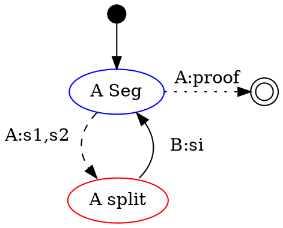
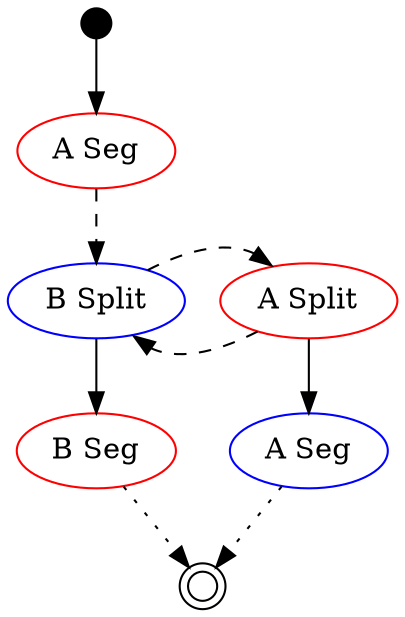

[Original hackmd](https://hackmd.io/_Gl1CuggQ1GiITy-giLuCg)

# Chusai Refutation game

Start : 2 players disagree on block (more specifically, the hash of the ending state)
- the starting point are the same: it is the hash of the state at the end of previous block
- the ending point are different: the disagree on the final state of the block / they propose blocks with different end state

Goal : refute one of the block

A segment is in dispute: 
- player A says that you can go from last state `s` (of hash `h`) to a state of hash `h'` in `n` steps. 
- player B says that after `n` steps, the hash should not be `h'`

We say that A defends the segment `from h to h' in n steps`

Correctness:
- a truthfull participant can always win
    - can there be opposing truthfull participants ?
    - difference between thruthfull/honest and correct ? another more relevant term ?
- the game does not garantee that at the end, the segment found has anything to do with the correct execution. 
    - During the bissection part, the states corresponding to the hashes exchanged are never checked: two players could exchange meaningless hash. 
    - At the end, one of them must provide a proof for the segment found during bissection, and that proof must show that you go from hash to the other, not that the operation is part of a normal execution.
- however, even if a block is not refuted, because a game was fixed, or because the challenger made a mistake, *it can still be challenged again*
    - as long as someone honest is observing the chain, he can challenge, and he will win if he makes no mistake.

## Architecture

The refutation game can be seperated in several parts:
- initialisation
    - blocks challenged
    - bond setting
- bissection
    - back and forth between players to find the first opcode disagreement
- verification
    - checking of one step proof
- resolution
    - deciding on winner
    - slashing
    - rejection of block

## Initialisation

- is number of operations fixed in a block ?
    - if not, it should at least be deterministic, otherwise two truthfull blocks can be in opposition
        - special case of game, where at the beginning the stacked on longer segment aggrees that opposing block is a prefix ?
    - take one with the biggest number of op ?
    - do block mention operations included ?
        - maybe not, but then finality of an operation in inbox is not known ? is it a pb ? maybe for withdraw
    - is it a question for the running of the game or the initiation of a game ?
- how to ensure a block "finishes" all operations ? 
    - exemple of cheat : normal execution takes 100 steps, but only run 90 steps. The hash are truthfull, but the final state is incorrect in the sense that some operations are not taken into account.
    - a way to fixe that is for the state to include the stack of all operations to precess, which allows to prove that final hash0 contains empty stack, therefore that all operations were finished. 
        - a proof of the last state would include the fact that the stack must be empty ?
        - still need to flag a hash as "should be last state" to know a check is needed
    - or a block doesn't refer to the list of operations at all
        - what happens when two honest blocks are proposed, but of different size ?
        - how does one knows when an operation is processed ?
    - is it in the definition of "valid block" ? 
        - a block contains the proof that execution stack is empty
    - is it a question for the running of the game or the initiation of a game or the verification of proof ?

## Bissection

```
segment = hash * hash * size
split = segment * segment
```

Start: One player proposes/defends a segment of `length > 1`
End: One player has to provide a proof for segment of `length = 1`

### Simple version of Bissection

`A` propose a segment, `B` challenges it
`A` either 
- provides a proof 
    - proof is checked
- or proposes 2 sub-segments
    - must be correct split: same ends, same overall size, all sub-segment are shorter
    -  `B` chooses which one to challenge


**Game 1: simple game (A defends)**

Legend:
- dashed edge = bissection
- solid edge = choice
- dotted edge = proof
- Red = B must make a move
- Blue = A must make a move

Sub-segment:
- consecutive, sum cover all segment (same start, same end)
- stricly smaller (size is `nat`)

Remarks:
- number of sub-segment is not important, what's important is that they are consecutive and cover previous segment
- sum of sizes of sub-segment must be less than size of segment, should be equal (but not strictly necessary for correctness)
- size of final segment is not important, what's important is that a checker can validate `A`'s proof

Correctness:
- if `A` proposes only truthfull splits, `B` has no winning strategy (it is possible to avoid censorship on truthfull blocks)
- if `A` proposes one untruthfull segment, `B` has winning strategy (it is possible to refute untruthfull block)

### options

- not 2 sub-segment but more, or any number (`>1`)
- provide split when chosing sub-segment
    - challenger role alternate
    - do we force the ends to meet ?
        - A proposes a split S1,S2 for a segment S proposed by B (S2 end is different than S end)
        - B proposes a split S3,S4 for segment S2
            - do we check that S4 end is the same as S end ? That is, do we check that B is consistent during the whole game ?
- more than 2 players
    - not a linear game but a tree ?
    - only staked players, stake lost when game lost
    - possible for new players to propose split from any published segment
    - once defender lost once, stake is lost for good and can't be winned by anybody else
- both player are staked on blocks, when they lose: lose stake + block rejected
    - is it necessary to provide block to initiate game or can a challenge be posed without providing a block first, as long as you have stake in the challenge ?

### More dynamic version: splits upon splits
**Game 2: provide split when challenging a segment (A defends at start)**

Legend:
- dashed edge = bissection
- solid edge = choice
- dotted edge = proof
- Red = B must make a move
- Blue = A must make a move
 
From top to bottom:
- Start with a segment provided by A
- B propose a split
    - same start, same overall length, **different end**
- A and B alternate proposing split
    - if last split `(s1,s2)` was proposed by A
    - then B chooses a segment in the split, either `s1` or `s2` 
    - and propose a split for it
- If they choose a segment of size `1`, they can't split, they demand a proof
- The required party provides a proof

### Proposal for implementation

```
type state = 
    | Start  of segment          
    | Split  of player * split    
    | End    of player * segment
```
At the beginning of the game, a `segment` of `A`is challenged.
Then the two players `A` and `B` alternate, starting with `B`. They either
- propose a `split`, *i.e* they designate which segment of the current `split` they attack, and provide a `split` for it.
    - the new `split` must have the same start as the `segment` under attack, the same overall `length` but a different ending point/hash
- ask for a proof of one of the `segment` in the current `split`

Remarks:
- the two first steps can be combined in one: 
    - the start of the game
    - the first split
- a split can be defined with more that 2 segments, same rules apply 
  
## Verification

## Resolution
- is there a timeout for a player's turn ?
    - if there is only a timeout global, then what happens when time runs out ? 
    - current player is slashed ? 
    - but then, 
- is there a timeout for a game ? what happens when a game is launched just before end of finality period ?


