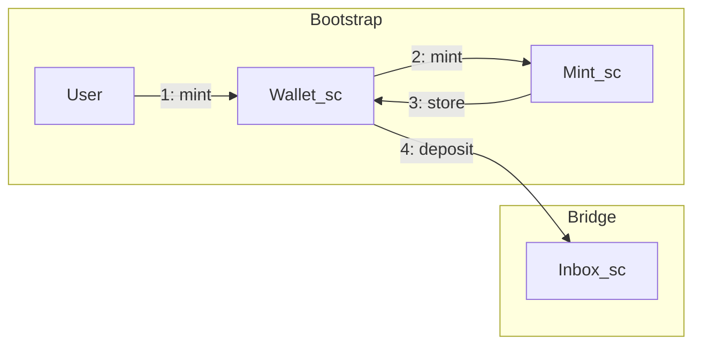

# Bootstrapping

> **Note** `Bootstrap` contains the set of contracts whose role is to _mint_ and
> provision a _rollup_.

## Global workflow

1. the `user` call the endpoint `Request_mint` of `Wallet_sc` with a certain amount of
   `xtz`.
2. `Wallet_sc` call the `Mint` endpoint of `Mint_sc` with the amount of `xtz` it
   receive
3. `Mint_sc` creates a ticket with that amount and resend it to 
   `Wallet_sc` by calling the `retreive_ticket` endpoint of `Wallet_sc`
4. `Wallet_sc` send to `Inbox_sc` (a `deposit_ticket`) which stores it into the inbox storages

